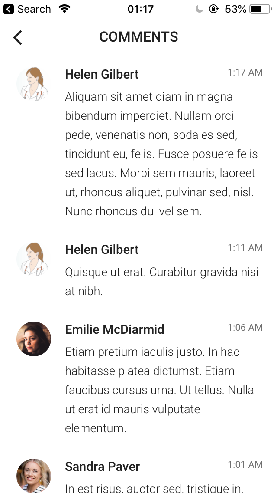

# OstoMentor
This is the project for Surgical Innovation program at McGill university I participated in.
## Key Features
+ Educational
+ Tracking stoma-output
+ Patients control over their medical records
+ Being connected with doctors and stoma nurses
+ Purchasing stoma supplies
+ ...
## Screenshots
 <figure>
   
   <figcaption>Welcome page</figcaption>
</figure>

 <figure>
   
   <figcaption>Home page</figcaption>
</figure>

 <figure>
   
   <figcaption>Educational articles available for the patients and their families</figcaption>
</figure>

 <figure>
   
   <figcaption> An example of educational article</figcaption>
</figure> 

 <figure>
   
   <figcaption>Social aspects of app: comments and experiences patients can share</figcaption>
</figure> 

 <figure>
   
   <figcaption>Forum</figcaption>
</figure> 

 <figure>
   
   <figcaption>Patients can ask their questions directly from their doctors and stoma-nurses.</figcaption>
</figure> 

 <figure>
   
   <figcaption>This Dashboard provides information about their stoma output and the medicine they have taken as well as how well they are learning educational materials.</figcaption>
</figure> 

 <figure>
   
   <figcaption>When patients enter their stoma output, the app makes a quiz and asks for the right amount of medicine the patient should take.</figcaption>
</figure> 

 <figure>
   
   <figcaption>The patients can buy stoma supplies inside the app.</figcaption>
</figure> 

 <figure>
   
   <figcaption>Controlling permissions over the medical records by the patient</figcaption>
</figure> 

 <figure>
   
   <figcaption>Dark theme of the app</figcaption>
</figure> 

 <figure>
   
   <figcaption>Profile settings</figcaption>
</figure> 

 <figure>
   
   <figcaption>Settings</figcaption>
</figure> 

## Made with help of
- [react-native](https://github.com/facebook/react-native)
- [react-native-ui-kitten](https://github.com/akveo/react-native-ui-kitten)
- [realm](https://github.com/realm/realm-js)
- [react-navigation](https://github.com/react-community/react-navigation)
- [victory-native](https://github.com/FormidableLabs/victory-native) charts
- [Google Analytics](https://github.com/idehub/react-native-google-analytics-bridge)

